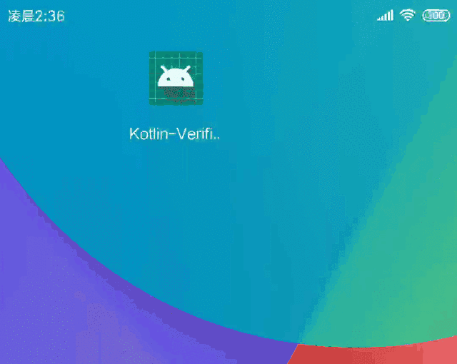

# Kotlin-VerificationView
VerificationView-手机验证码输入框 [](https://jitpack.io/#limxing/Kotlin-VerificationView)




## Usage
#### Gradle

Project level build.gradle
```
buildscript {
    ext.kotlin_version = '1.3.21'
}
...
allprojects {
    repositories {
        maven { url 'https://jitpack.io' }
    }
}
```
App level build.gradle
```
dependencies {
    implementation 'com.github.limxing:Kotlin-VerificationView:1.0'
}
```

### XML
```
 <me.leefeng.libverify.VerificationView
        android:layout_width="0dp"
        android:layout_height="40dp"
        app:vTextCount="6"
        app:vBackgroundResource="@drawable/bac_square_selector"
        app:vTextSize="15dp"
        android:layout_marginTop="8dp"
        android:id="@+id/verificationView3"
        android:layout_marginEnd="8dp"/>

```
vTextCount  : 验证码位数

vTextColor  ：字体颜色

vTextSize   ：字体大小，注意：layout_height 属性须大于textSize的2倍，否则效果欠佳

vBackgroundResource ：每一个输入框的选中背景色

vCursorDrawable ：光标颜色，否则默认主题色

vBackgroundColor： 背景色，与vBackgroundResource互斥

vAutoShowInputBoard：是否自动弹出键盘，默认true


### Code

kotlin
```kotlin
verificationView.finish = {
    Toast.makeText(this,"$it",Toast.LENGTH_SHORT).show()
}
```
java
```java
VerificationView verificationView = findViewById(R.id.verificationView);
verificationView.setFinish(new Function1<String, Unit>() {
    @Override
    public Unit invoke(String s) {
        Toast.makeText(Main2Activity.this, s, Toast.LENGTH_SHORT).show();
        return null;
    }
});
```


#### License
LaplaceKLine is available under the MIT license.
